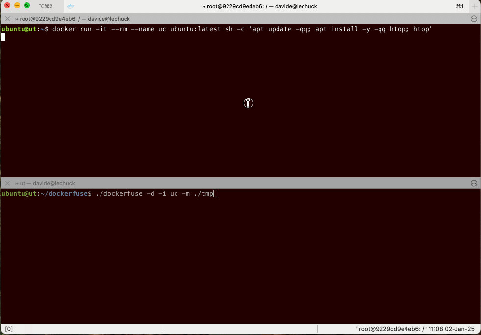

# DockerFuse: interact with filesystem of Docker containters, via FUSE

[](https://opensource.org/licenses/Apache-2.0) [](https://goreportcard.com/report/github.com/dguerri/dockerfuse) [](https://github.com/dguerri/dockerfuse/actions/workflows/run-CI.yml) [](https://coveralls.io/github/dguerri/dockerfuse?branch=main)

***NOTE: this software is a WIP, use at your risk!***

DockerFuse allows mounting the filesystem of Docker containers locally, without installing additional services on the container (e.g. ssh).



## Testing

To run Unit tests (very few for now):

```bash
make test
```

To run an interactive test, pulling `alpine` image, spinning up a container and mounting its filesystem on ./tmp:

```bash
make interactive_test
```

To invoke dockerfuse manually:

```bash
cd <dockerfuse dir>
make all
./dockerfuse -id <container id/name> -mount <mountpoint>
```

## FAQ

### Q. How does it work?

Dockerfuse uploads a small "server" on the container (the dockerfs satellite).
The satellite and the client (`dockerfuse`) communicate over stdin and stdout via the hijacked connection Docker Engine provides through `ContainerExecAttach()`.
This means no additional ports (or software, like ssh) is needed to remotely mount the docker filesystem.

Presently the server is left on the container when the filesystem is unmounted. In the future, it will clean up after itself, by immediately deleting the executable from the filesystem (and possibly using /dev/shm where available).

### Q. How is it different from [plesk/docker-fs](https://github.com/plesk/docker-fs)?

Docker-fs uses Docker Engine to provide access to the container's filesystem, and that has important limitations.
To name some: Docker-fs has to download the whole container image on start (using it as a tar FS with FUSE) and use it as a tar-based FS with FUSE (making initial access very slow). It cannot create empty direcotries and it cannot handle large files (read/writes operates on the entire file).

Dockerfuse implements operations needed by FUSE through RPC calls and a satellite app.
Dockerfuse satellite uses native systemcall (through the Go standard library) on the running container image. For filesystem operations, this is both faster and more flexible than using Docker Engine's API.

The obvious caveat is that while docker-fs doesn't need any additional software on the container, dockerfuse has to uplad a small binary (i.e. ~ 4 MBytes) to the container.
The satellite is light-weight also for the computational power requirement, so it shouldn't affect your workload. Of course the actual load depends on the filesystem operations performed (and it should be noted that MacOS issues a huge number of `Getattr()` (STATFS) calls, potentially [affecting FUSE performances](https://github.com/hanwen/go-fuse#macos-support))

### Q. Does it work on remote Docker servers?

Yeah. Dockerfuse can work on local Docker instances or on remote ones.
It uses the environment (i.e., `DOCKER_HOST`, `DOCKER_TLS_VERIFY`, `DOCKER_CERT_PATH`) to connect to the Docker server, and then it operates via TCP(*).

(*) Tecnically Dockerfuse uses a TCP connection which is "upgraded" from an HTTP connection, similarly to what happens with web sockets.

### Q. Does it work for arm64 containers?

Yeah. The makefile creates 2 satellite instances, one for amd64 and one for arm64.
When mountig a remote container, Dockerfuse inspect the related image and uploads the right satellite instance.

This allows you to mount the filesystem of an arm64 container on a amd64 machine, and the way around.

## License

Apache License v2. See LICENSE.TXT for details.

## Author

Davide Guerri <davide.guerri@gmail.com>
